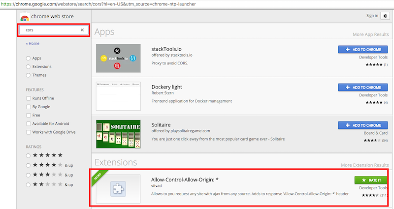

# TWXML_UI

## How to use it?
TWXML_UI is built on top of NodeJS, using ExpressJS framework, Boostrap and JQuery.

Don't worry, to start using it you just have to install NodeJS on your local machine and follow the simple instructions below.

It doesn't take you more then 10 minutes to be productive with the ThingWorx Machine Learning UI Tool.

### IMPORTANT CONSIDERATION
The tool has been tested only with **TWXML rev 50.4**. You can download the VM from [here](https://pds.ptc.com/Windchill/app/#ptc1/tcomp/infoPage?oid=OR%3Awt.folder.SubFolder%3A1176949521&ContainerOid=OR%3Awt.projmgmt.admin.Project2%3A1160732408&u8=1).
Below credentials both for OS and TWXML:

|  Key            |  Value     |
|-----------------|------------|
| VM Username     | vagrant    |
| VM Password     | vagrant    |
| neuron-app-id   | neuronuser |
| neuron-app-key  | neuronuser |

Before you start, make sure Google Chrome is installed on your PC.

TWXML_UI tool requires Google Chrome due the fact that it requires a Google Chrome plugin in order to allow CORS calls. The only task that requires this plugin is the **CSV file upload (Upload dataset)**. _I haven't had time for code refactoring in order to remove this limitation._
Others task can be accomplished using other browsers like IE 10 or later versions (not IE 7, 8 and 9) as well as Mozilla Firefox.

Once Google Chrome is installed on your PC go to the [Chrome Web Store](https://chrome.google.com/webstore/search/cors?hl=en-US&utm_source=chrome-ntp-launcher) and search for **cors**. Install the **Allow-Control-Allow-Origin: *** extension.



### Step-by-Step installation on your PC
Here is a step-by-step guide to configure and start using TWXML_UI:
1. Download and install [NodeJS](https://nodejs.org/en/)
2. After that, open a shell / cmd window and check the installation typing `node -v` and `npm -v`
3. Download this project and extract it on your PC
4. Open a shell / cmd window and move to the path where you extracted this project
5. Type `npm install` in order to install all the dependency
6. Open and edit the `config/default.json` file. Specify the connection details for the ThingWorx ML server you will work against.
7. Start the server typing:
  - `node bin\www` for Windows users
  - `node bin/www` for Linux or OSX users
8. Open Google Chrome and go to [http://localhost:3000](http://localhost:3000)
9. Enable CORS extension installed before to use TWXML_UI tool
  

**Remember** to enable the CORS plugin before you start working with the tool.

### Step-by-Step installation on Neuron-solo VM
It is possible to deploy TWXML_UI directly on the Neuron VM instead of installing it on your local computer. To do it follow instructions below:

1. Download and install VirtualBox from [here](https://www.virtualbox.org/wiki/Downloads)
2. Run the NeuronSolo VM and log-in
3. Install prerequisites typing `sudo yum install net-tools gcc gcc-c++ make`
4. Download and install NodeJS from sources in order to use the latest version:
```shell
[vagrant@neuron ]$ wget https://nodejs.org/dist/latest/node-v5.3.0.tar.gz
[vagrant@neuron ]$ tar xvzf node-v5.3.0.tar.gz
[vagrant@neuron ]$ cd node-v5.3.0
[vagrant@neuron ]$ ./configure
[vagrant@neuron ]$ make
[vagrant@neuron ]$ make install
```
5. Check the installation typing `node -v` and `npm -v`
6. See instructions for _Step-by-Step installation on your PC_ above excluding **step 1**.
